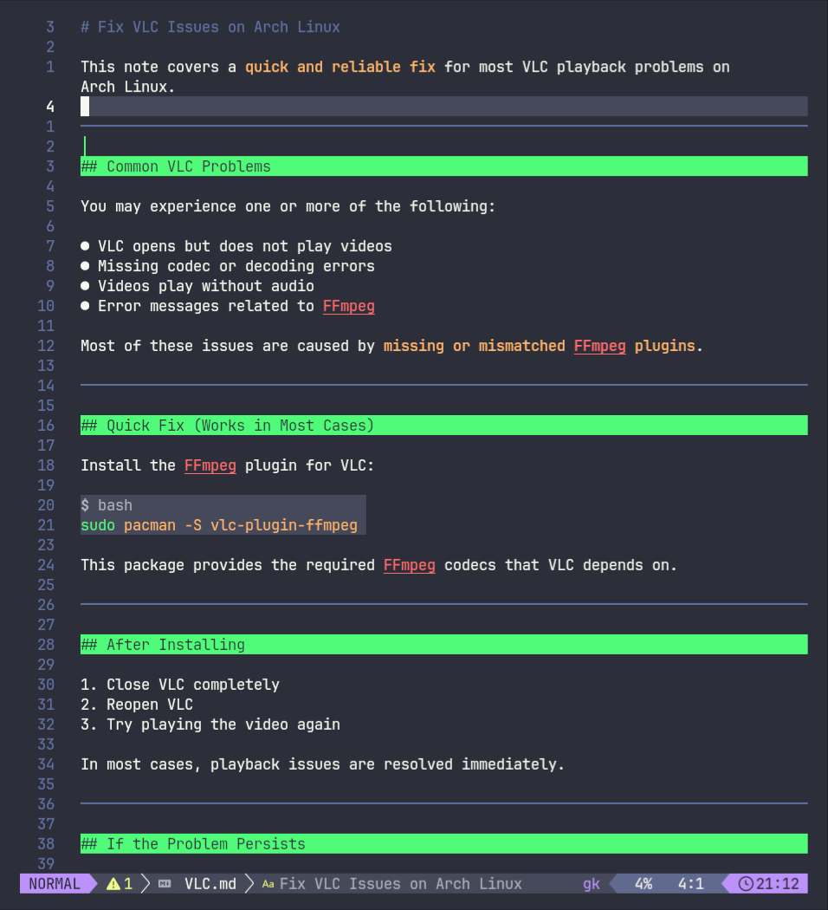

[[VLC]]
[[plymouth]]
[[python-nvim-setup]]
[[ssh_git]]

# Heading 1

## Heading 2

### Heading 3

#### Heading 4

##### Heading 5

###### Heading 6



```python {filename="demo.py"}
def main() -> None:
  sum = 0
  for i in range(10):
    sum += i
    print(sum)

if __name__ == "__main__":
  main()
```

# Unordered List

- List Item 1: with [link](https://example.com)

- List Item 2: with `inline` code
  - Nested List 1 Item 1
  - Nested List 1 Item 2
    - Nested List 2 Item 1
    - Nested List 2 Item 2

- List Item 3: with [reference link][example]

# Ordered List

1. Item 1
1. Item 2

# Table

| 'left' | _center_ | Right | None |
| :----- | :------: | ----: | ---- |
| 'code' |  _bold_  | plain | Item |

# Checkbox / Dash / Quote

- [ ] unchecked box
- [x] checked box
- [-] Todo checkbox
- regular list item

---

> quote line 1
> quote line 2

# Note

> [!NOTE]

> [!TIP]

> [!IMPORTANT]

> [!WARNING]

> [!CAUTION]

> [!BUG]

# Neovim Config

```lua

return {
  "MeanderingProgrammer/render-markdown.nvim",
  ft = { "markdown" }, -- load only for markdown files
  opts = {
    heading = {
      enabled = true,
      render_modes = true,
      atx = true,
      setext = true,
      -- sign = { "󰫎 " },
      sign = true,
      width = "block",
      icons = { "󰼏 ", "󰎨 ", "󰼐 ", "󰎲 ", "󰼑 ", "󰎴 " },
      position = "overlay",
    },

    checkbox = {
      enabled = true,
      render_modes = true,
      unchecked = {
        -- Replaces '[ ]' of 'task_list_marker_unchecked'.
        icon = "󰄱 ",
        -- Highlight for the unchecked icon.
        highlight = "RenderMarkdownUnchecked",
        -- Highlight for item associated with unchecked checkbox.
        scope_highlight = nil,
      },
      checked = {
        -- Replaces '[x]' of 'task_list_marker_checked'.
        icon = "󰱒 ",
        -- Highlight for the checked icon.
        highlight = "RenderMarkdownChecked",
        -- Highlight for item associated with checked checkbox.
        scope_highlight = nil,
      },
    },
    code = {
      enabled = true,
      render_modes = true,
      sign = true,
    },
  },
}

```
