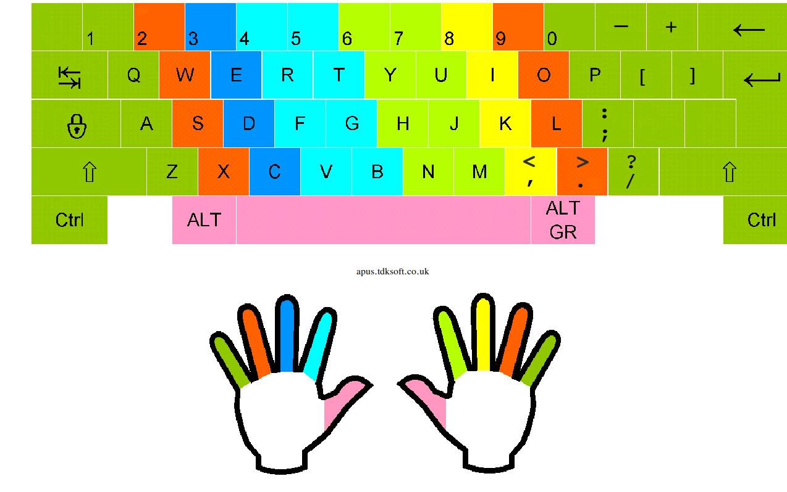

# Typing

The first and most important thing is learn how to type in the right way if you are using the laptop. It will improve the speed and quality for you're work .

## Steps

1. keep the hands in the home row which are j, k , l and f, d, s, a . Use the bums in the f and j key to navigate back to the home row .
2. Stop looking at the keyboard . Work with muscle memory instaded of eyesight
3. Practice typing for 30mint daily. Use sits like [typing.com](https://www.typing.com)
4. Use nvim editor for daily code work so that it may help with keyboard since it uses keyboard keys mainly.
5. Focus on accuracy first speed will come along with it.
6. Learn about common patterns.
7. First learn to use keyboard in way that it is designed then over time change the keyboard according your will.[advanced ]
8. Last and far mostly the important thing is practice typing daily .
9. Set a task to practice typing in your daily notes both in today and tomorrow notes so that you can review and remember about typing.
10. Just come and visit this note once in a while so you can review your position in typing.

## Notes

## References

- i have found an cli tool which can used to practice typing more offend which is ttyper tool
- use the site [typing.com](https://www.typing.com) to learn about the methods for typing and use ttyper as tool to practice what have been learned fhttps://github.com/catlee/omarchy-dracula-themerom that site.
  

## Note-link

[[11110-typing|Typing]]
